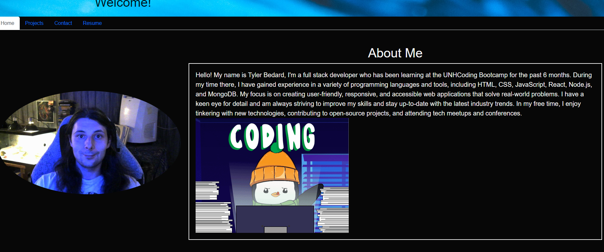

# Tylers React Portfolio

## Table of Contents:

1. [Description](#description)
2. [Installation](#installation)
3. [Usage](#usage)
4. [Contributing](#contributing)
5. [Tests](#tests)
6. [Questions](#questions)
7. [License](#license)

## Description:

This is a portfolio made for week 20 of my coding bootcamp!

## Installation:

If you want this on your local machine, gitclone the repo then open it up and nmp i inside the root of the project . After that you can do npm run start and go to localhost:3000 to be on the page. Or you can just check it out on the live deplopyed site! https://tbedard126.github.io/react_portfolio/

## Usage:

This application is to help show off my skills I have learned over the past 6 months.

## Contributing:

This was a solo project

## Tests:

N/A

## Questions:

Email: tylerbedard126@gmail.com

GitHub:
[tbedard126](https://github.com/tbedard126)

Email is the best way to get in touch with me

## License:

MIT
